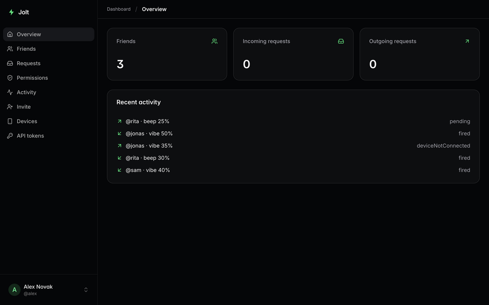

# Jolt Server

**The self-hostable backend for Jolt: friends poking each other's Pavlok
wearables, with permissions each person controls.**

[](https://github.com/petrleocompel/jolt-server/actions/workflows/ci.yml)
[](LICENSE)
[](https://petrleocompel.github.io/jolt-server/)



Jolt is an independent iOS client for Pavlok wearables. This server holds
the accounts, the friend graph and the poke history, and delivers each poke to
the recipient's phone. Anyone can run their own instance: the app
takes a server URL in its settings. The iOS app is in private testing
(TestFlight) for now.

## Features

- **Per-stimulus permissions.** Each friend gets separate allow flags,
  intensity caps and cooldowns for zap, vibe and beep, set by the person
  receiving them and enforced by the server on every poke.
- **Push without an Apple account.** The Jolt push relay delivers your
  server's pushes to the official app builds, end-to-end encrypted so the
  relay cannot read them; your own APNs key works too. Every poke is sent as an
  alert plus a silent push, and the device acknowledges the outcome (`fired`,
  `muted`, `deviceNotConnected`, …). Without push configured the server logs
  pushes instead of sending them, and everything else keeps working.
- **Personal access tokens.** Your own scripts can jolt you or poke friends.
  Each token has its own scopes, friend list, intensity and rate limits, and
  each recipient decides whether a friend's automations may reach them.
- **No discovery, by design.** You can't search for users. Friend requests
  need an exact `@handle` or an invite code shared out of band.
- **Web dashboard.** Friends, requests, permissions, activity, devices with a
  push delivery test, and API tokens, plus an admin area for users, pokes and
  server settings.
- **Contract first.** [`openapi/jolt-v1.yaml`](openapi/jolt-v1.yaml) is the
  canonical API, CI fails when the server's schemas drift from it, and every
  instance serves it at `/openapi.yaml`.

## Self-host in one command

You need Docker with the Compose plugin and a domain pointing at the machine,
with ports 80 and 443 open. Caddy fetches the TLS certificate.

```bash
mkdir jolt && cd jolt
curl -fsSLO https://raw.githubusercontent.com/petrleocompel/jolt-server/main/compose.yaml
curl -fsSL -o .env https://raw.githubusercontent.com/petrleocompel/jolt-server/main/.env.example
```

Set these three in `.env`:

| Variable | Value |
| --- | --- |
| `APP_HOST` | Your domain, e.g. `jolt.example.com` (no scheme) |
| `BETTER_AUTH_SECRET` | `openssl rand -base64 48`. Changing it later logs everyone out. |
| `POSTGRES_PASSWORD` | Any long random string |

```bash
docker compose up -d
curl https://jolt.example.com/healthz
```

Create the first admin account:

```bash
docker compose exec -e ADMIN_EMAIL=you@example.com -e ADMIN_PASSWORD='at-least-12-chars' app pnpm db:seed-admin
```

Then in the app open **Settings → Server → Server URL**, enter
`https://jolt.example.com/api/v1` and tap **Test connection**.

The [self-hosting docs](https://petrleocompel.github.io/jolt-server/) cover
every configuration variable, running behind an existing reverse proxy, push
notifications, upgrades and backups.

## Configuration

Everything is set through environment variables; [`.env.example`](.env.example)
lists them all with comments. Beyond the three above, the ones you are most
likely to touch:

| Variable | Default | Purpose |
| --- | --- | --- |
| `PUBLIC_URL` | `https://$APP_HOST` | Public origin, if TLS ends elsewhere or you serve plain HTTP on a LAN |
| `TRUSTED_ORIGINS` | none | Other origins browsers may sign in from, comma-separated |
| `PUSH_RELAY_URL` | none (no public relay yet) | Push relay to deliver through, with no Apple credentials of your own |
| `PUSH_RELAY_IDENTITY_SECRET` | none | Seals the server's relay identity in the database. Required with the relay in production |
| `PUSH_RELAY_SERVER_NAME`, `PUSH_RELAY_PUBLIC_URL` | none | Opt-in: tell the relay operator who you are |
| `APNS_KEY_ID`, `APNS_TEAM_ID`, `APNS_KEY_P8` | none | APNs token auth, for your own app build. Set all three |
| `APNS_BUNDLE_ID`, `APNS_ENV` | `cz.peelco.jolt`, `production` | Must match the app build on the phone |
| `AUTOMATION_CONSENT_REQUIRED` | unset (an admin decides) | Whether friends' tokens need each recipient's consent |
| `PUSH_TIME_ZONE` | `UTC` | Time zone of the time shown in notification text |
| `POKE_EVENT_RETENTION_DAYS`, `FRIEND_REQUEST_EXPIRY_DAYS` | `90`, `30` | Retention for the hourly cron jobs |
| `JOLT_VERSION` | `latest` | Image tag to run, e.g. `0.1.0` or `edge` (tracks `main`) |

## Development

Requires Node 22, pnpm (`corepack enable`) and Docker for Postgres.

```bash
cp .env.example .env          # set BETTER_AUTH_SECRET at minimum
docker compose --env-file .env -f deploy/docker-compose.yml -f deploy/docker-compose.dev.yml up -d db
pnpm install
pnpm db:migrate
pnpm db:seed-admin            # needs ADMIN_EMAIL + ADMIN_PASSWORD in the environment
pnpm dev                      # http://127.0.0.1:3000
```

| Command | Purpose |
| --- | --- |
| `pnpm dev` | Dev server on :3000 |
| `pnpm lint` / `pnpm typecheck` | ESLint and TypeScript (run `pnpm generate-routes` first) |
| `pnpm test` | Vitest unit tests |
| `pnpm e2e:up` / `pnpm test:e2e` / `pnpm e2e:down` | Playwright contract walk against a throwaway Postgres on :5433 |
| `pnpm openapi:check` | Fail when the spec and `src/api/schemas.ts` disagree |
| `pnpm db:generate` / `db:migrate` / `db:studio` | Drizzle migrations and studio |
| `pnpm cron --list` / `pnpm cron --once <job>` | List or run the retention jobs |

To build the image from source instead of pulling it, use
`deploy/docker-compose.yml` with its overlays (see the comments at the top
of that file).

### Project layout

```text
openapi/jolt-v1.yaml   canonical API contract
src/routes/            TanStack Start pages and API routes (/api/v1/*)
src/api/               request schemas (Zod), auth bridge, response shaping
src/services/          friends and permissions, pokes, devices, API tokens, settings
src/push/              APNs and push relay senders, relay crypto, the console fallback
src/db/                Drizzle schema; migrations live in drizzle/
src/cron/              retention and cleanup jobs
deploy/                compose files for development, e2e and building from source
docs/                  documentation site (Astro Starlight)
```

Stack: TanStack Start (React SSR and API routes) on Nitro, Drizzle ORM with
Postgres, Better Auth.

## Contributing

Issues and pull requests are welcome. See [CONTRIBUTING.md](CONTRIBUTING.md):
first-time contributors sign the [CLA](CLA.md) once, by commenting on their PR.
The iOS app is built by the maintainer's private CI; server contributions go
through GitHub pull requests. Please report security issues privately, as
described in [SECURITY.md](SECURITY.md).

## License

[AGPL-3.0-only](LICENSE). You can self-host, modify and share it; if you run a
modified version as a network service, you have to offer its source to your
users. The license covers the code, not the Jolt name or logo.

Jolt is not affiliated with or endorsed by Pavlok.
